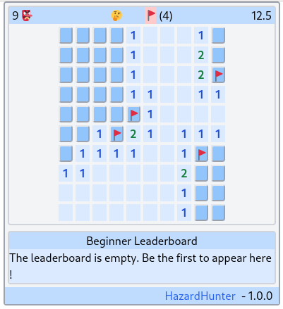

# Takoyaki

Takoyaki is some experiment of on HTMX/Haskell WEB SPA(s).

Here is the list of available applications:

- HazardHunter



- Todolist (WIP)

## Start via nix flake

To run an app (for instance the HazardHunter app) from the nix flake:

```
nix run github:morucci/takoyaki -- HazardHunter
firefox http://127.0.0.1:8092
```

Or from the local checkout

```
nix run .# -- HazardHunter
firefox http://127.0.0.1:8092
```

## Start via the last published container image

```
mkdir ~/takoyaki-home
podman run -it --rm --network host -v ~/takoyaki-home:/var/lib/takoyaki:Z docker.io/morucci/takoyaki:latest takoyaki HazardHunter
firefox http://127.0.0.1:8092
```

## Build the container image

The container can be built this way:

```
nix build .#container
podman load < ./result
```

## Hack on the code

```Shell
# Enter the nix develop shell
nix develop

# Start ghicd on the Module app you want to hack on
ghcid -W -c 'cabal repl' -r="Demo.Todo.run 8092"
ghcid -W -c 'cabal repl' -r="Demo.HazardHunter.run 8092"

# Open the browser to get interactive feedback
firefox http://127.0.0.1:8092

# Run your code editor in the nix shell
code .
```

